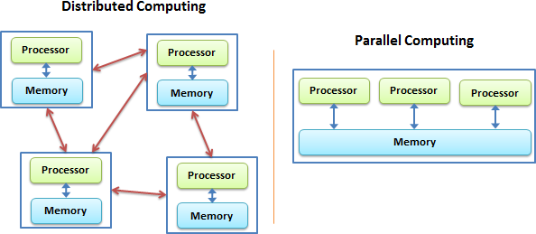
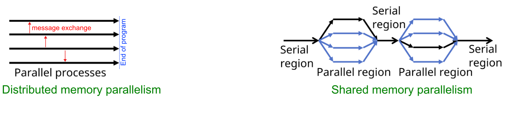
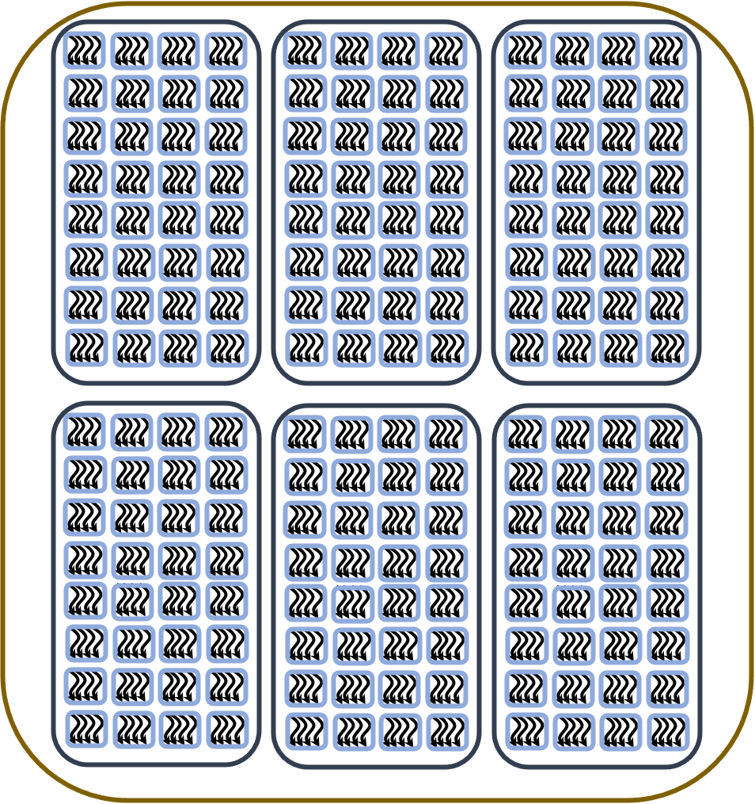
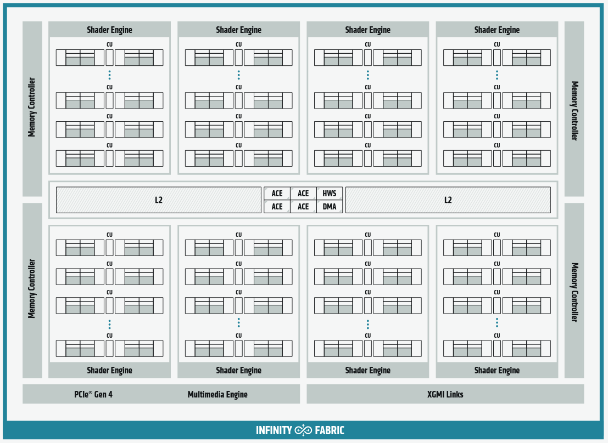
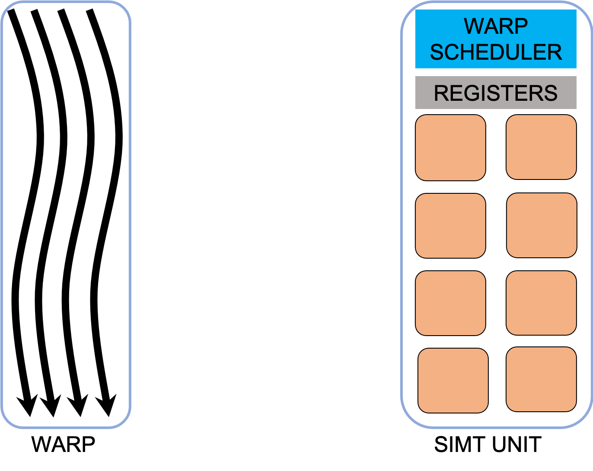
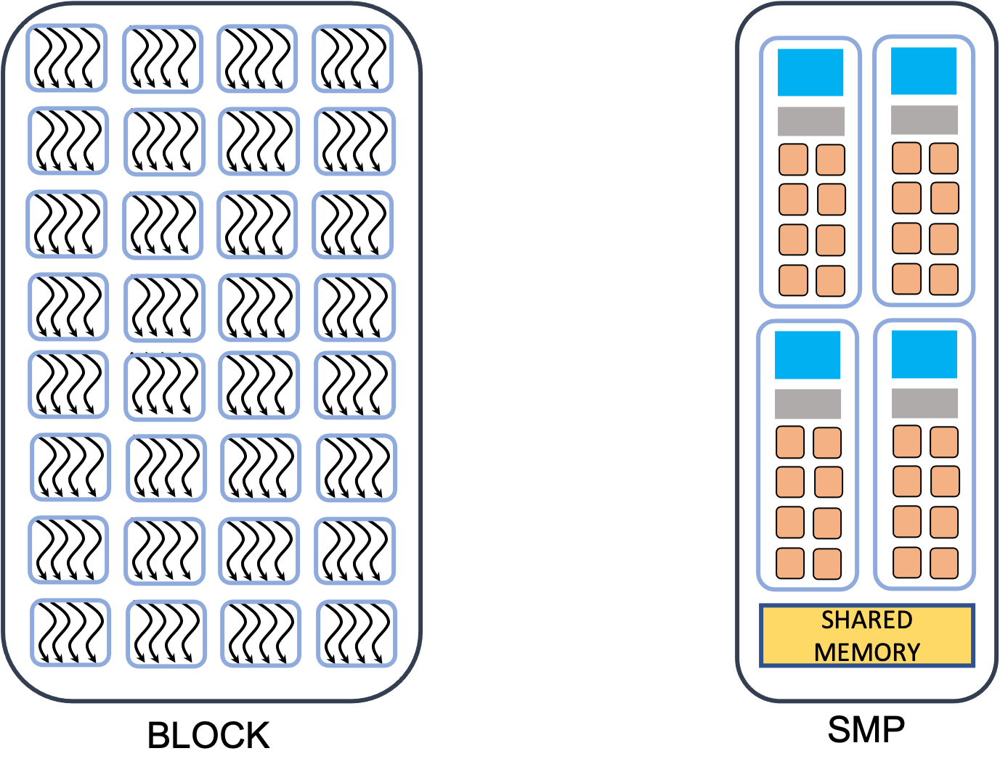

# GPU programming concepts {.section}

# Distributed- vs. Shared-Memory Computing

{.center width=94%}

# Processes and Threads

{.center width=84%}

* <small>**Process**-based parallel programming model is used on distributed memory machines.</small>
   + <small>independent execution units which have their *own memory* address spaces.</small>
   + <small>life time of the program.</small>
* <small>**Thread** based parallelism is used on shared memory architectures.</small>
   + <small>light execution units; are created/destroyed at a relatively small cost.</small>
   + <small>own state information, but they *share* the *same memory* address space.</small>

# Exposing Parallelism

{.center width=75%}

- The **data parallelism** is when the same operation applies to multiple data (e.g. multiple elements of an array are transformed).
- The **task parallelism** implies that there are more than one independent task that, in principle, can be executed in parallel.

# GPU Execution Model

{.center width=68%}


# Example: axpy

<div class="column">

Serial cpu code of `y=y+a*x`:

- have a loop going over the each index


<small>
```cpp
void axpy_(int n, double a, double *x, double *y)
{
    for(int id=0;id<n; id++) {
        y[id] += a * x[id];
    }
}
```
</small>
</div>

<div class="column">

On an accelerator:

- no loop 
- we create instances of the same function, **kernels**
<small>

```cpp
GPU_K void ker_axpy_(int n, double a, double *x, double *y, int id)
{
        y[id] += a * x[id]; // id<n
}

```
</small>

</div>

# Grid of CUDA Threads

<div class="column">


{.center width=60%}

<div align="center"><small>A grid of cuda threads executing the same **kernel**</small></div>

</div>

<div class="column">
{.center width=87%}

<div align="center"><small>AMD Instinct MI100 architecture (source: AMD)</small></div>
</div>

- <small>Each thread executes the same kernel computing different elements of data. </small>
- <small>There is no global synchronization or data exchange.</small>


# CUDA Thread

{.center width=66%}

- <small>The **CUDA threads** are very light execution contexts, containing all information needed to execute a stream of instructions.</small>
- <small>Each **CUDA thread** processes different elements of the data.</small>
- <small>Each **CUDA thread** has its own state information</small>

# Warp

{.center width=39%}

- <small>The CUDA threads are physically locked into **warp**s, currently of size 64 for AMD and 32 for Nvidia.</small>
- <small>All threads in the **warp** have to execute the same instruction.</small>
- <small>The memory accesses are done per warp.</small>

# Block of Threads

{.center width=40%}

- <small>The threads  are divided in groups of fixed size,  (max 1024 for some GPUS).</small>
- <small>Each block is assign to a SMP and it can not be split. </small>
- <small>Synchronization and data exchange is possible inside a block.</small>

# Indexing

{.center width=80%}


# Terminology

<small>


NVIDIA/HIP                         OpenCL/SYCL
--------------------------------   -----------
grid of threads                    NDRange
block                              work-group            
warp/wavefront                     sub-group
thread                             work-item
local memory                       private memory
shared memory/local data share     local memory
threadIdx.{x,y,z}                  get_local({2,1,0})
blockIdx.{x,y,z}                   get_group_id({0,1,2})
blockDim.{x,y,z}                   get_local_size({0,1,2})/get_local_range({2,1,0})

</small>

# Summary

   - <small>Parallel computing can be classified into distributed-memory and shared-memory architectures.</small>
   - <small>Two types of parallelism that can be explored are data parallelism and task parallelism.</small>
   - <small>GPUs are a type of shared memory architecture suitable for data parallelism.</small>
   - <small>GPUs have high parallelism, with threads organized into warps and blocks and.</small>
   - <small>GPU optimization involves coalesced memory access, shared memory usage, and high thread and warp occupancy. Additionally, architecture-specific features such as warp-level operations and cooperative groups can be leveraged for more efficient processing.</small>
