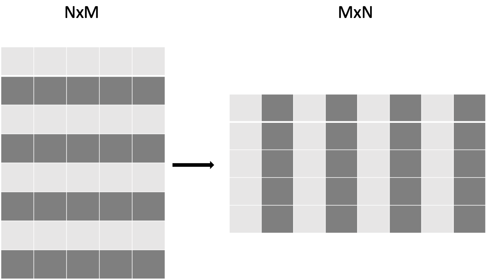
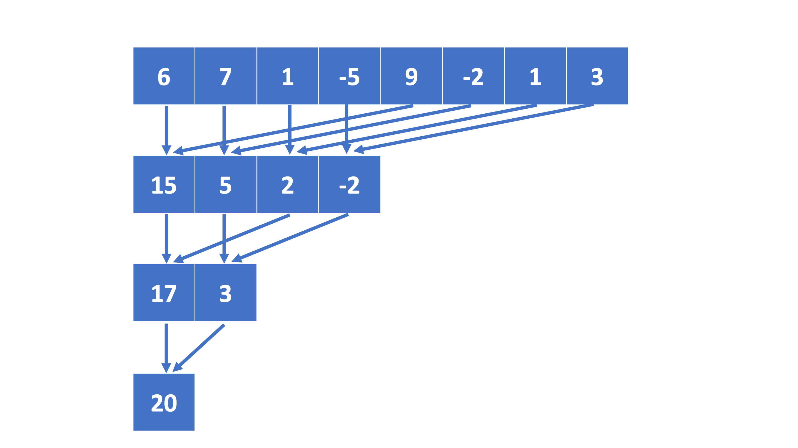

# Non-portable kernel-based models. Fundamentals {.section}

# CUDA  and HIP 

- CUDA and HIP are  solely focused on GPUs. 
- CUDAand ROCM toolkits  provide  all the necessary tools and advance features to write higly optimized applications for running on GPUs: 
   - extensive libraries
   - low level APIs
   - compiler toolchains that optimize code execution on NVIDIA GPUs (in the case of CUDA) and both NVIDIA and AMD GPUs (in the case of HIP)
   - debugging and performance analysis tools

# Hello World

```cpp
#include <hip/hip_runtime.h>
#include <stdio.h>

int main(void){
  int count, device;

  hipGetDeviceCount(&count);
  hipGetDevice(&device);

  printf("Hello! I'm GPU %d out of %d GPUs in total.\n", device, count);
  return 0;
}
```

# Vector Addition

<div class="column">
<small>
```cpp

__global__ void vector_add(float *A, float *B, float *C, int n){
   int tid = threadIdx.x + blockIdx.x * blockDim.x;
   if(tid<n){
      C[tid] = A[tid]+B[tid];
   }
}

``` 

```cpp
#include <hip/hip_runtime.h>
#include <stdio.h>
#include <stlib.h>
#include <math.h> 
int main(){ 
   const int N = 10000;
   float *Ah, *Bh, *Ch, *Cref;
   float *Ad, *Bd, *Cd;

   // Allocate the arrays on CPU
   Ah =(float*)malloc(n * sizeof(float));Bh =...;Ch =...; Cref =...;

   // Initialise data and calculate reference values on CPU
   for (i=0; i < n; i++) {
      Ah[i] = sin(i) * 2.3;
      Bh[i] = cos(i) * 1.1;
      Cref[i] = Ah[i] + Bh[i];} 
```
</small>
</div>

<div class="column">
<small>
```cpp
   // Allocate the arrays on GPU
   hipMalloc((void**)&Ad, N * sizeof(float));
   hipMalloc((void**)&Bd, N * sizeof(float));
   hipMalloc((void**)&Cd, N * sizeof(float));

   // Transfer the data from CPU to GPU
   hipMemcpy(Ad, Ah, sizeof(float) * n, hipMemcpyHostToDevice);
   hipMemcpy(Bd, Bh, sizeof(float) * n, hipMemcpyHostToDevice);
   
   // define grid dimensions + launch the device kernel
   dim3 blocks, threads;
   threads=dim3(256,1,1);
   blocks=dim3((N+256-1)/256,1,1);
   
   //Launch Kernel
   //hipLaunchKernelGGL(vector_add, blocks, threads, 0, 0, Ad, Bd, Cd, N); // or
   vector_add<<< blocks, threads,0,0>>(Ad, Bd, Cd, N);
   
   // copy results back to CPU
   hipMemcpy(Ch, Cd, sizeof(float) * N, hipMemcpyDeviceToHost);

   // Free the GPU arrays
   hipFree(Ad); hipFree(Bd); hipFree(Cd);

   printf("Result: %f %f %f \n", Ch[3], Ch[n-2], Ch[n-1]);
```
</small>
</div>

# Vector Addition with Unified Memory


<div class="column">
<small>
```cpp
__global__ void vector_add(float *A, float *B, float *C, int n){
   int tid = threadIdx.x + blockIdx.x * blockDim.x;
   if(tid<n){
      C[tid] = A[tid]+B[tid];
   }
}

``` 
```cpp
int main(){ 
   const int N = 10000;
   float *Ah, *Bh, *Ch, *Cref;

   // Allocate the arrays using Unified Memory
   hipMallocManaged((void **)&Ah, N * sizeof(float));
   hipMallocManaged((void **)&Bh, N * sizeof(float));
   hipMallocManaged((void **)&Ch, N * sizeof(float));
   hipMallocManaged((void **)&Cref, N * sizeof(float));

   // Initialise data and calculate reference values on CPU
   for (i=0; i < n; i++) {
      Ah[i] = sin(i) * 2.3;
      Bh[i] = cos(i) * 1.1;
      Cref[i] = Ah[i] + Bh[i];}
   // All data at this point is on CPU
```
</small>
</div>

<div class="column">
<small>
```cpp
   // define grid dimensions + launch the device kernel
   dim3 blocks, threads;
   threads=dim3(256,1,1);
   blocks=dim3((N+256-1)/256,1,1);
   
   //Launch Kernel
   //hipLaunchKernelGGL(vector_add, blocks, threads, 0, 0, Ad, Bd, Cd, N); // or
   vector_add<<< blocks, threads,0,0>>(Ad, Bd, Cd, N);
   hipDeviceSynchronize(); // Wait for the kernel to complete

   //Access the data on the CPU
   printf("Result: %f %f %f \n", Ch[3], Ch[n-2], Ch[n-1]);

   // Free the Unified Memory arrays
   hipFree(Ah);
   hipFree(Bh);
   hipFree(Ch);
   hipFree(Cref);
```
</small>
</div>

# Non-portable kernel-based models. Memory optimizations {.section}

# Coalesced Access

{.center width=39%}

- <small>The CUDA threads are physically locked into **warp**s, currently of size 64 for AMD and 32 for Nvidia.</small>
- <small>All threads in the **warp** have to execute the same instruction.</small>
- <small>The memory accesses are done per warp.</small>

# Coalesced vs Non-coalesced Memory Access

```cpp

__global__ void vector_add(float *A, float *B, float *C, int n, int stride, int shift){
   int tid = threadIdx.x + blockIdx.x * blockDim.x;
   if(tid<n){
      C[tid] = A[tid]+B[tid]; //Coalesced

      C[tid*stride] = A[tid*stride]+B[tid*stride]; //Strided Non-Coalesced

      C[tid+shift] = A[tid+shift]+B[tid+shift]; //Shifted Non-Coalesced
   }
}

``` 
- Local shared memory can be used to improve the memory accesses.


# Block of Threads and Local Shared Memory

{.center width=40%}

- <small>Each block is assign to a SMP and it can not be split. </small>
- <small>Synchronization and data exchange is possible inside a block.</small>

# Optimizing matrix operations. `B(i,j)=A(j,i)` 
{.center width=60%}


# Copy operation as base

```cpp
__global__ void copy_kernel(float *in, float *out, int width, int height) {
  int x_index = blockIdx.x * tile_dim + threadIdx.x;
  int y_index = blockIdx.y * tile_dim + threadIdx.y;

  int index = y_index * width + x_index;

  out[index] = in[index];
}
```

```cpp
  int block_x = width / tile_dim;
  int block_y = height / tile_dim;
   hipLaunchKernelGGL(copy_kernel, dim3(block_x, block_y),
                      dim3(tile_dim, tile_dim), 0, 0, d_in, d_out, width,
                      height);
   hipDeviceSynchronize();
```
The effective bandwidth is  `717 GB/s`, out of the theoretical peak `900 GB/s`.

# Matrix transpose naive

```cpp
__global__ void transpose_kernel(float *in, float *out, int width, int height) {
  int x_index = blockIdx.x * tile_dim + threadIdx.x;
  int y_index = blockIdx.y * tile_dim + threadIdx.y;

  int in_index = y_index * width + x_index;
  int out_index = x_index * height + y_index;

  out[out_index] = in[in_index];
}
```

The effective bandwidth is `311 GB/s`.

# Matrix transpose with shared memory

<small>
```cpp
__global__ void transpose_lds_kernel(float *in, float *out, int width,
                                     int height) {
  __shared__ float tile[tile_dim][tile_dim];

  int x_tile_index = blockIdx.x * tile_dim;
  int y_tile_index = blockIdx.y * tile_dim;

  int in_index =
      (y_tile_index + threadIdx.y) * width + (x_tile_index + threadIdx.x);
  int out_index =
      (x_tile_index + threadIdx.y) * height + (y_tile_index + threadIdx.x);

  tile[threadIdx.y][threadIdx.x] = in[in_index];

  __syncthreads();

  out[out_index] = tile[threadIdx.x][threadIdx.y];
}
```
</small>

The effective bandwidth is `674 GB/s`.


# Matrix transpose with shared memory without bank conflicts

<small>
```cpp
__global__ void transpose_lds_kernel(float *in, float *out, int width,
                                     int height) {
  __shared__ float tile[tile_dim][tile_dim+1];

  int x_tile_index = blockIdx.x * tile_dim;
  int y_tile_index = blockIdx.y * tile_dim;

  int in_index =
      (y_tile_index + threadIdx.y) * width + (x_tile_index + threadIdx.x);
  int out_index =
      (x_tile_index + threadIdx.y) * height + (y_tile_index + threadIdx.x);

  tile[threadIdx.y][threadIdx.x] = in[in_index];

  __syncthreads();

  out[out_index] = tile[threadIdx.x][threadIdx.y];
}
```
</small>

On a NVIDIA V100 GPU this final code achieves an  effective bandwidth `697 GB/s`, out of the theoretical peak `900 GB/s`.

# Reductions

- `Reductions` refer to operations in which the elements of an array are aggregated in a single value through binary operations.
- Examples include summing, finding the maximum or minimum, or performing logical operations.
- Assumptions for being able to perform them in parallel:
   - the order of the iterations does not change the results. `a+b=b+a` 
   - doing the operations on small subsets, and then on the results does not change the results. `(a+b)+c=a+(b+c)`

# Reduction in parallel

- Divide the problem in subsets which can be processed in parallel.
- Each susbset is processed by a block of threads.
- Have an efficient reduction at block level:
   - keep as many as possible threads doing work. 
   - avoid global memory accesses using local data share.

# Tree Reduction Inside a Block of Threads

{.center width=80%}

# CUDA/HIP Reduction

<small>
```cpp
#define tpb 512 // size in this case has to be known at compile time
// this kernel has to be launched with at least N/2 threads
__global__ void reduction_one(double x, double *sum, int N){
  int ibl=blockIdx.y+blockIdx.x*gridDim.y;
  int ind=threadIdx.x+blockDim.x*ibl;

  __shared__ double shtmp[2*tpb];
  shtmp[threadIdx.x]=0; // for sums we initiate with 0, for other operations should be different
  if(ind<N/2){
     shtmp[threadIdx.x]=x[ind];
  }
  if(ind+N/2<N){
     shtmp[threadIdx.x+tpb]=x[ind+N/2];
  }
  __syncthreads();
  for(int s=tpb;s>0;s>>=1){
    if(threadIdx.x<s){
       shtmp[threadIdx.x]+=shtmp[threadIdx.x+s];}
    __syncthreads();
  }
  if(threadIdx.x==0){
    sum[ibl]=shtmp[0]; // each block saves its partial result to an array
    // atomicAdd(&sum[0], shene[0]); // alternatively could aggregate everything together at index 0. Only use when there not many partial sums left
  }
}
```
</small>

# CUDA/HIP Streams
- Modern GPUs can overlap independent operations.
- CPU-GPU data transfers can be overllapped with lernel execution.
- **CUDA/HIP streams**  are independent execution units, a sequence of operations that execute in issue-order on the GPU.
- The operations issue in different streams can be executed concurrently.
- Utilizing multiple streams, the GPU can avoid idle time, especially for problems with frequent CPU communication or multi-GPU setups.

# Overlapping Computations and Memory transfer. 

{.center width=94%}

# Vector Addition with Streams

<small>
```cpp
// Distribute kernel for 'n_streams' streams, and record each stream's timing
for (int i = 0; i < n_streams; ++i) {
  int offset = i * (N/stream_size);
  hipEventRecord(start_event[i], stream[i]); // stamp the moment when the kernel is submitted on stream i

  hipMemcpyAsync( &Ad[offset],  &Ah[offset], N/n_streams*sizeof(float), hipMemcpyHostToDevice, stream[i]);
  hipMemcpyAsync( &Bd[offset],  &Bh[offset], N/n_streams*sizeof(float), hipMemcpyHostToDevice, stream[i]);
  vector_add<<<gridsize / n_streams, blocksize, 0, stream[i]>>>(&Ad[offset], &Bd[offset], &Cd[offset], N/n_streams); //each call processes N/n_streams elements
  hipMemcpyAsync( &Ch[offset],  &Cd[offset], N/n_streams*sizeof(float), hipMemcpyDeviceToHost, stream[i]);

  hipEventRecord(stop_event[i], stream[i]);  // stamp the moment when the kernel on stream i finished
}
...
```
</small>

# Summary

- CUDA and HIP are the native programming models for NVIDIA and AMD GPUs.
- The programmer can take advantage of all GPU features.
- NVIDIA has a very extensive ecosystem. AMD is catching up.
- HIP is open source and can be used on both NVIDIA and AMD platforms.
- They are exclusive for NVIDIDA and AMD GPUs.
- Both CUDA and HIP require learning GPU programming concepts.
- Memory optimizitions are very important.
